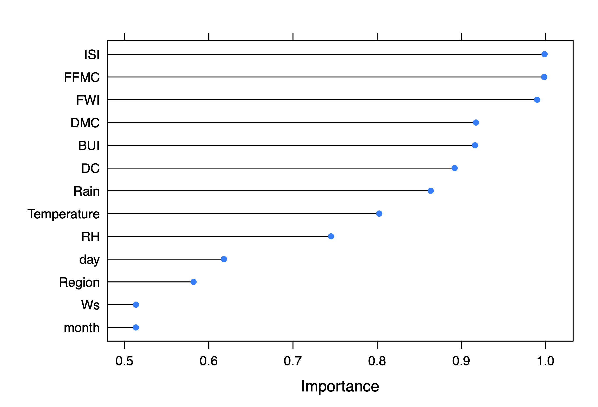

```{r include = FALSE}
knitr::opts_chunk$set(warning=FALSE)
```
## Overview
### Background

During the summer of 2012, [wild fires](https://www.un-spider.org/news-and-events/news/algeria-maps-summer-2012-wildfires-available) ravaged throughout the Algerian territory covering most of the northern part, especially the coastal cities. This disaster was due to the higher than average temperatures which reached as high as 50 degrees Celcius.

### Objectives 

One important measure against the reproduction of such disasters is the ability to predict their occurrence. Moreover, in this project, we will attempt to predict these forest fires based on multiple features related to weather indices.

### Dataset Description

The Dataset we will use to train and test our models consists of 244 observations on two Algerian Wilayas (cities): Sidi-Bel Abbes and Bejaia. The observations have been gathered throughout the duration of 4 months from June to September 2012 for both cities.

**The Dataset contains the following variables:**

1. Date: (DD/MM/YYYY) Day, month ('june' to 'september'), year (2012)
2. Temp: temperature noon (temperature max) in Celsius degrees: 22 to 42
3. RH: Relative Humidity in %: 21 to 90
4. Ws: Wind speed in km/h: 6 to 29
5. Rain: total day in mm: 0 to 16.8<br>
**FWI Components (check this [LINK](https://cwfis.cfs.nrcan.gc.ca/background/summary/fwi) for more information)**
6. Fine Fuel Moisture Code (FFMC) index from the FWI system: 28.6 to 92.5
7. Duff Moisture Code (DMC) index from the FWI system: 1.1 to 65.9
8. Drought Code (DC) index from the FWI system: 7 to 220.4
9. Initial Spread Index (ISI) index from the FWI system: 0 to 18.5
10. Build-up Index (BUI) index from the FWI system: 1.1 to 68
11. Fire Weather Index (FWI) Index: 0 to 31.1
12. Classes: two classes, namely "fire" and "not fire"

## Exploratory Data Analysis

We first start off by importing the necessary libraries for our analysis.

The libraries we used are the following:

1. e1071: this package is used to perform statistic and probabilistic algorithms. In our case it is used to perform SVM
2. MASS: This package includes many useful functions and data examples, including functions for estimating linear models through generalized least squares (GLS)
3. plyr: contains tools for splitting, applying and combining data
4. caret: a powrful library that has a train function which allows us to fit over 230 models uncluding tree-based models
5. ROCR: a flexible tool for creating cutoff-parameterized 2D performance curves by freely combining two from over 25 performance measures
6. pROC: a package specifically dedicated to ROC analysis
7. randomForest: performs classification and regression on a forest of trees using random inputs
8. gbm: short for generalized boosted models, provides extensions to Schapire's AdaBoost algorithm
9. dplyr: used for data manipulation providing a set of functions that are very useful
10. tidyverse: contains multiple essensial tools and packages such as ggplot2 for visualization
11. caTools: used for splitting our dataset into train/test sets


```{r, include=FALSE}
library(e1071)
library(MASS)
library(dplyr)
#library(vtable)
library(plyr)
library(ggplot2)
library(ggcorrplot)
library(plotly)
library(tidyverse)
#Feature selection libraries
#library(mlbench)
library(caret)
#For Logistic regression
library(caTools)
#For ROC curve
library(ROCR)
library(pROC)
#ensemle methods
library(randomForest)
library(gbm)
```


### Importing the data 

The Dataset provided to us was in the form of a .csv file that contained two tables, one table for the observations belonging to the Sidi-Bel Abbes region, and the other for Bejaia. 

Before starting our analysis we separated the tables into two distinct files according to the region. We named both files *Algerian_forest_fires_dataset_Bejaia.csv* and *Algerian_forest_fires_dataset_Sidi_Bel_Abbes.csv* for Bejaia and Sidi-Bel Abbes respectively.


```{r, message=FALSE}
df_b <- read.csv("./Algerian_forest_fires_dataset_Bejaia.csv")
df_s <- read.csv("./Algerian_forest_fires_dataset_Sidi_Bel_Abbes.csv")
```

### Cleaning and processing the data

We first check the existence of null values in the Dataset, none were found.

```{r}
colSums(is.na(df_b))
colSums(is.na(df_s))
```

We then process to add a column in both datasets to indicate the region(Wilaya) in each table. We chose the following encoding:

1. Bejaia = 0
2. Sidi-Bel Abbes = 1


```{r, echo=FALSE}
df_b[["Region"]] = 0
df_s[["Region"]] = 1
```

After that, we proceed to merge both our datasets into one single dataframe using *full_join()*, this will allow us to easily explore and analyze the data.

```{r, echo=FALSE}
df_s$DC <- as.double(df_s$DC)
df_s$FWI <- as.double(df_s$FWI)

df = full_join(df_s, df_b)
```

```{r, include = FALSE}
dim(df)
str(df)
summary(df)
unique(df$year)
unique(df$month)
```

We check again for any *NA* values that might have been introduced into the dataset by merging the data from both tables, we found out there was one row that contained NA value in DC and FWI. We delete that row since it will not affect our overall dataset.

```{r}
colSums(is.na(df))
df = df %>% drop_na(DC)
dim(df)
```

We now proceed to display the different range of values some categorical variables might contain, mainly the Classes and the Region columns.


```{r}
unique(df$Classes)
unique(df$Region)
```

We find that the Classes column has values that contain unneeded space characters, we proceed to trim those spaces.

```{r}
df$Classes <- trimws(df$Classes, which = c("both"))

unique(df$Classes)
df = df %>% drop_na(Classes)
```

We then turn the fire/not fire values into 1/0 respectively for future analysis.

```{r}
df$Classes <- mapvalues(df$Classes, from=c("not fire","fire"), to=c(0,1))
```

```{r}
unique(df$Classes)
df$Classes <- as.numeric(df$Classes)
str(df)
```

We delete the year column since all observations were performed in the same year

```{r}
df <- df[-c(3)]

df_scaled = df
df_scaled[-c(1,2,13,14)] <- scale(df[-c(1,2,13,14)])
str(df_scaled)

```

### Visualizing the data

We have ended up with a clean and scaled dataframe named *df_scaled*, which we will use to visualize and further explore our data.

Our first instinct is to compare the two regions together in terms of number of fires, and average temperature. 

```{r}
aggregate(df$Classes ~ df$Region, FUN = sum)
aggregate(df$Temperature ~ df$Region, FUN = mean)
```

We used the unscaled dataset to plot the real life values of the temperatures.

```{r}
df %>%
  group_by(Region) %>%
  summarise(Region = Region, Number_of_fires = sum(Classes), Temperature = mean(Temperature)) %>%
  ggplot(aes(x=Region, y=Number_of_fires, fill = Temperature))+
  geom_col(position='dodge')
```

We can see that the the Sidi-Bel Abbes region has in total a greater number of fires and a higher average temperature throughout the summer of 2012.

## Further Analysis

### Correlation Matrix

The previous results push us to suspect a positive relationship between the temperature and the likelihood of having a fire. However, we need to investigate all the other variables, which is why we will plot a correlation matrix of the features in the dataset.

```{r}
corr_mat <- round(cor(df_scaled),2)
p_mat <- cor_pmat(df_scaled)
 
corr_mat <- ggcorrplot(
  corr_mat, 
  hc.order = FALSE, 
  type = "upper",
  outline.col = "white",
)
 
ggplotly(corr_mat)
```

### Feature Selection

We performed feature selection using the Caret package to determine which features are the most important and which are the least. 

In this case, we opted for Linear Discriminant Analysis with Stepwise Feature Selection by specifying *stepLDA* as our method.

The *varImp* function returns a measure of importance out of 100 for each of the features. According to the official [Caret documentation](https://topepo.github.io/caret/variable-importance.html), the importance metric is calculated by conducting a ROC curve analysis on each predictor; a series of cutoffs is applied to the predictor data to predict the class. The AUC is then computed and is used as a measure of variable importance. 


```{r, results="hide", include=FALSE }
# prepare training scheme
df_scaled$Classes = as.factor(df_scaled$Classes)
control <- trainControl(method="repeatedcv", number=10, repeats=3)
# train the model
modelLDA <- train(Classes~., data=df_scaled, method="stepLDA", trControl=control)
importanceLDA <- varImp(modelLDA, scale=FALSE)
plot(importanceLDA)
```

NOTE: we hid the output of the above chunk because it resulted in a long console message, in the end it resulted in the following figure. To see the original output delete the *include=FALSE* term.




We can see that the variables *month*, *Ws*, *Region*, and *day* are insignificant compared to other features. We will disregard them in our model. To determine this we used a threshold of 0.7 for the *importance* measure.


## Model Building

For the following models, we will only use the features that were the most significant in our feature selection phase. The selected features are:

1. Temperature
2. Rain
3. FFMC
4. DMC
5. DC
6. ISI
7. BUI
8. FWI
9. RH

### Splitting the dataset

We begin by splitting the data into train/test sets with a 80/20 split. This split was chosen by default as a good practice. This will leave us with 191 observations in the training set as well as 52 in the test set. Due to the small nature of the dataset at hand we will later apply cross validation to some models in order to further examine their performance and compare them with each other.

We set a seed of 1


```{r}
set.seed(40)
split <- sample.split(df_scaled, SplitRatio=0.8)

train_set <- subset(df_scaled, split == "TRUE")
test_set <- subset(df_scaled, split=="FALSE")

dim(train_set)
dim(test_set)

```

### Logistic Regression

Logistic Regression is considered to be an extension of Linear Regression, in which we predict the qualitative response for an observation. It gives us the probability of a certain observation belonging to a class in binomial classification, but can also be extended to be used for multiple classifications.


#### Training the model

We first start by fitting our model on the training set. As we do that we get an error that our model did not converge, this is due to our model being able to perfectly split the dataset into positive/negative observations. This might soud counterintuitive but this error is a good sign.

```{r, warning = FALSE, error = FALSE}
logistic_model <- glm(Classes ~ Temperature+Rain+FFMC+DMC+DC+ISI+BUI+FWI+RH, data=train_set, family="binomial")

logistic_model
```

#### Testing the model

Since logistic regression gives us the probability of each observation belonging to the 1 class, we will use a 0.5 threshold to transform that probability into a classification of either 0 or 1.

After getting our predictions, we will use the confusion matrix function from the caret library that computes a set of performance matrices including f1-score, recall and precision. Other matrices computed include: sensitivity, specificity, prevalence etc. The official documentation for this function and the formulas for all matrices are found in this [link.](https://rdrr.io/cran/caret/man/confusionMatrix.html) We will only be interested in the f1-score, recall, precision, accuracy and balanced accuracy.

#### On the training set

Our model gives us an accuracy and an f1 score of 100% on the training set.

```{r, warning = FALSE}
preds_logistic <- predict(logistic_model, train_set, type="response")

preds_logistic <- ifelse(preds_logistic >0.5,1,0)
preds_logistic <- as.factor(preds_logistic)

confusionMatrix(preds_logistic, train_set$Classes,
                mode = "everything",
                positive="1")
```


#### On the testing set

On the test set however, we get an accuracy of 88.68% and an f1 score of 88.89%.

```{r}

train_set$Classes <- as.factor(train_set$Classes)
test_set$Classes <- as.factor(test_set$Classes)

preds_logistic <- predict(logistic_model, test_set, type="response")

preds_logistic <- ifelse(preds_logistic >0.5,1,0)
preds_logistic <- as.factor(preds_logistic)

confusionMatrix(preds_logistic, test_set$Classes,
                mode = "everything",
                positive="1")
```

#### Plotting the ROC curve

As we plot the ROC curve, we can see that the AUC is equal to 88.67%.

```{r, echo = FALSE}
ROCPred <- prediction(as.numeric(preds_logistic), test_set$Classes)

ROCPer <- performance(ROCPred, measure="tpr",x.measure="fpr")
auc <- performance(ROCPred, measure = "auc")
auc <- auc@y.values[[1]]
print(paste("The AUC is: ",auc))
plot(ROCPer)
```


### LDA

Linear Discriminant Analysis is best used when the decision boundary of our given dataset is assumed to be linear. There are two basic assumptions that LDA takes into consideration:

1. There is a common variance across all response classes
2. The distribution of observations in each response class is normal with a **class-specific** mean, and a **common** variance


Since LDA assumes that each input variable has the same variance, we will use the standardized data-frame in the train test splits. Each variable in the standardized data-frame has mean of 0 and variance of 1.

#### Training the model


```{r}
lda_model = lda(Classes ~ Temperature+Rain+FFMC+DMC+DC+ISI+BUI+FWI+RH, data=train_set, family="binomial")
lda_model
```


#### Testing the model

#### On the training set

On our training data, the model reached an accuracy of 95.79% and an f1 score of 96.40%.

```{r}
preds_lda = predict(lda_model,train_set, type="response")
confusionMatrix(preds_lda$class, train_set$Classes,
                mode = "everything",
                positive="1")
```

#### On the testing set

As we can see below, the number of false negatives is 1. Our model also yielded an accuracy of 98.11% and an f1 score of 98.11%.

```{r}
preds_lda = predict(lda_model,test_set, type="response")
confusionMatrix(preds_lda$class, test_set$Classes,
                mode = "everything",
                positive="1")
```

#### Potting the ROC curve

The AUC for LDA was 98.14%, similar to the one for Logistic Regression.

```{r, echo = FALSE}
ROCPred <- prediction(as.numeric(preds_lda$class), test_set$Classes)
ROCPer <- performance(ROCPred, measure="tpr",x.measure="fpr")
auc <- performance(ROCPred, measure = "auc")
auc <- auc@y.values[[1]]
print(paste("The AUC is: ",auc))
plot(ROCPer)
```


### QDA

Quadratic Discriminant Analysis is best used when the decision boundary of our given dataset is assumed to be non-linear. Similarly to LDA, QDA makes two basic assumptions: 

1. There is a different covariance for each of the response classes
2. The distribution of observations in each response class is normal with a **class-specific** mean, and a **class-specific** covariance


#### Training the model


```{r}
qda_model = qda(Classes ~ Temperature+Rain+FFMC+DMC+DC+ISI+BUI+FWI+RH, data=train_set)
qda_model
```


#### Testing the model

##### On the training set

Our model yields an accuracy of 98.42% and an f1 score of 98.64% on the training set.

```{r}
preds_qda = predict(qda_model,train_set, type="response")
confusionMatrix(preds_qda$class, train_set$Classes,
                mode = "everything",
                positive="1")
```

##### On the testing set

As we can see below our model yielded an f1-score of 94.55% and an accuracy of 94.34%.  

```{r}
preds_qda = predict(qda_model,test_set, type="response")
confusionMatrix(preds_qda$class, test_set$Classes,
                mode = "everything",
                positive="1")
```

#### Potting the ROC curve

After plotting the ROC curve we got an AUC of 94.30%, which is worse than both logistic regression and LDA.

```{r, echo = FALSE}
ROCPred <- prediction(as.numeric(preds_qda$class), test_set$Classes)
ROCPer <- performance(ROCPred, measure="tpr",x.measure="fpr")
auc <- performance(ROCPred, measure = "auc")
auc <- auc@y.values[[1]]
print(paste("The AUC is: ",auc))
plot(ROCPer)
```

We can observe that QDA performs better than LDA on the training data, because it has the tendency to over-fit it. However, LDA performs better on the testing data since it generalizes better on unseen data points.

### KNN Classifier

In this section, we will explore KNN's performance on our problem. We will use hyper parameter tuning to determine the best number of nearest numbers (K) and we will also use repeated cross validation in our training for better performance estimation. 

Since KNN is a distance based model, we will here again use our normalized dataset instead of the original.

#### Training the model

##### Setting up the Cross-Validation for Hyperparameter tuning

The summaryFunction argument determines which metric to use to determine the performance of a particular hyperparameter setting. Here we shall use defaultSummary which calculates accuracy and kappa statistic. 

We have opted to go with the repeated 10 fold cross-validation method repeated 10 times. ClassProbs parameter is set to TRUE and we can set the threshold later when we test our model performance.

```{r}
training_control <- trainControl(method = "repeatedcv",
                                 summaryFunction = defaultSummary,
                                 classProbs = TRUE,
                                 number = 10,
                                 repeats = 10)
```

##### Training with Cross-validation

Now we use the train() function to perform the model training/tuning of the k hyper-parameter.
The range of k is from 3 to 85 in steps of 2 meaning we will only have odd values of k only as it is best practice for the KNN clustering.

Another tweak that we need to make on our data-set is to change our target variable values to valid R variable names in order for the KNN algorithm to work with class Probabilities as each values of our target variable will become a variable with its own probability values. Leaving the values as {0,1} will throw an error at us, therefore we will set our Classes variable values back to 'fire' and 'not_fire' and proceed. 

```{r}

train_set_knn <- train_set
test_set_knn <- test_set
train_set_knn$Classes <- mapvalues(train_set$Classes, from=c(0,1), to=c("not_fire","fire"))
test_set_knn$Classes <- mapvalues(test_set$Classes, from=c(0,1), to=c("not_fire","fire"))

```


```{r}
knn_cv <- train(Classes ~ Temperature+Rain+FFMC+DMC+DC+ISI+BUI+FWI+RH, 
                data = train_set_knn,
                method = "knn",
                trControl = training_control,
                metric = "Accuracy",
                tuneGrid = data.frame(k = seq(3, 85, by = 2)))
knn_cv
```

##### Distribution of predicted probabilites -threshold inspection-

Inspecting the probabilities reveals that a cutoff probability around 0.5 gives the best classification results. In the function *predict* the cutoff is set to be 0.5 by default which means we do not need to change it.

```{r}
preds_knn = predict(knn_cv,train_set_knn, type = "prob")
train_set %>%
  ggplot() +
  aes(x = preds_knn$fire, fill = Classes) +
  geom_histogram(bins = 20) +
  labs(x = "Probability", y = "Count", title = "Distribution of predicted probabilities for value fire" )
```

#### Testing the model

When testing our model on the test set however, we get an accuracy of 90.57% and an f1 score of 90.91%

```{r}
preds_knn = predict(knn_cv,test_set_knn, type="raw")
confusionMatrix(preds_knn, test_set_knn$Classes,
                mode = "everything",
                positive="fire")

```

#### Potting the ROC curve

After plotting the ROC curve, we get an AUC of 90.52%.

```{r, echo = FALSE}
preds <- prediction(as.numeric(preds_knn), as.numeric(test_set_knn$Classes)) 
perf <- performance(preds,"tpr","fpr")
auc <- performance(preds, measure = "auc")
auc <- auc@y.values[[1]]
print(paste("The AUC is: ",auc))
plot(perf)
```
 
### Ensemble Methods / Tree based methods

#### Simple Decision Trees and tree pruning

The goal of ensemble modeling is to improve performance over a baseline model by combining multiple models. So, we will set the baseline performance measure by starting with one algorithm. In our case, we will build a simple decision tree.

Decision trees are widely used classifiers in industries based on their transparency in describing rules that lead to a prediction. They are arranged in a hierarchical tree-like structure and are simple to understand and interpret. They are not susceptible to outliers and are able to capture nonlinear relationships.

We will be using the *rpart* library for creating decision trees. (rpart) stands for recursive partitioning and employs the CART (classification and regression trees) algorithm. Apart from the *rpart* library, there are many other decision tree libraries like *C50*, *Party*, *Tree*, and *mapTree.*

```{r, results='hide'}
library(rpart)
library(rpart.plot)
```

#### Training the model without the pruning

Next, we create a decision tree model by calling the *rpart* function. Let's first create a base model with default parameters and value. Notice that we do not include any train control meaning that we are not using any bagging, cross validation or pruning techniques. The resulting tree is a simple decision tree that splits our observations of the *FFMC* variable. We will explore the performance of the model on the train and test sets next.

```{r}
base_model <- rpart(Classes ~ Temperature+Rain+FFMC+DMC+DC+ISI+BUI+FWI+RH, data = train_set, method = "class")
summary(base_model)
#Plot Decision Tree
rpart.plot(base_model)
```


#### Testing the unpruned model

#### On the training set

After exploring the confusion matrix and the different performance metrics, we can see that our base decision tree does not fit the data perfectly and has 3 miss-classifications on the training set. Those 4 false positives caused the model's accuracy to be 98.42% and the f1 score to be 98.62%.

```{r}
preds_unpruned= predict(base_model, train_set, type="class")
confusionMatrix(preds_unpruned, train_set$Classes, mode = "everything", positive='1')
```

#### On the testing set

Our base decision tree performs very well on unseen, an accuracy of 92.45% and an f1-score of 92%. 

```{r}
preds_unpruned = predict(base_model,test_set, type="class")
confusionMatrix(preds_unpruned, test_set$Classes,
                mode = "everything",
                positive='1')

```
#### ROC curve for unpruned model

This model gives us an AUC of 92.59%.

```{r, echo = FALSE}
preds <- prediction(as.numeric(preds_unpruned), test_set$Classes) 
perf <- performance(preds,"tpr","fpr")
auc <- performance(preds, measure = "auc")
auc <- auc@y.values[[1]]
print(paste("The AUC is: ",auc))
plot(perf)
```

#### Training the model with pruning

Pre-pruning is also known as early stopping criteria. As the name suggests, the criteria are set as parameter values while building the rpart model. Below are some of the pre-pruning criteria that can be used. The tree stops growing when it meets any of these pre-pruning criteria, or it discovers the pure classes.

The complexity parameter (cp) in rpart is the minimum improvement in the model needed at each node. It is based on the cost complexity of the model and works as follows: 

- For the given tree, add up the missclassification at every terminal node.
- Then multiply the number of splits time a penalty term (lambda) and add it to the total misclassification.
- The lambda is determined through cross-validation and not reported in R.
- The cp we see using printcp() is the scaled version of lambda over the misclassifcation rate of the overall data.

The cp value is a stopping parameter. It helps speed up the search for splits because it can identify splits that don't meet this criterium and prune them before going too far.

Other parameters include but are not limited to: 

- maxdepth: This parameter is used to set the maximum depth of a tree.

- minsplit: It is the minimum number of records that must exist in a node for a split to happen or be attempted.

And one last thing, since we are in a classification setting, we have to specify class as the method used for building our tree instead of 'anova' that is used in regression settings. 

```{r}
pruned_base_model <- rpart(Classes ~ Temperature+Rain+FFMC+DMC+DC+ISI+BUI+FWI+RH, data = train_set, method = "class",  control = rpart.control(cp = 0, maxdepth = 8, minsplit = 5))
summary(pruned_base_model)
#Plot Decision Tree
printcp(pruned_base_model)
rpart.plot(pruned_base_model)
```


The summary of our base model will give us the details of each split with the number of observations, the value of the complexity parameter, the predicted class, the class counts with their probabilities and the children of the node. It will also give details about the future splits starting with the primary splits that will follow and the percent improvement in the prediction as well as the surrogate splits that come later on. 

The resulting tree as explained in the above section, is the smallest tree with the lowest miss-classification loss. This tree is plotted with the split details and leaf node classes. 

The optimal *cp* value was found in the above output.

#### Testing the pruned model 

#### On the training set


```{r}
preds_pruned = predict(pruned_base_model,train_set, type="class")
confusionMatrix(preds_pruned, train_set$Classes,
                mode = "everything",
                positive='1')
```

The train accuracy of our tree is 99.47% with an f1 score of 99.54% as well with only one miss-classifications.  

##### On the testing set

We have a 96.23% accuracy on our held-out validation set which is better than the unpruned tree, meaning we have successfully avoided over-fitting using tree pruning. 

```{r}
preds_pruned = predict(pruned_base_model,test_set, type="class")
confusionMatrix(preds_pruned, test_set$Classes,
                mode = "everything",
                positive='1')
```

##### ROC curve for pruned model

The resulting AUC is 96.29%

```{r, echo = FALSE}
pred <- prediction(as.numeric(preds_pruned), test_set$Classes) 
auc <- performance(pred, measure = "auc")
auc <- auc@y.values[[1]]
print(paste("The AUC is: ",auc))
perf <- performance(pred,"tpr","fpr")
plot(perf)
```


### BAGGING

Bagging, or bootstrap aggregation, is an ensemble method that involves training the same algorithm many times by using different subsets sampled from the training data. The final output prediction is then averaged across the predictions of all the sub-models. The two most popular bagging ensemble techniques are Bagged Decision Trees and Random Forest.

#### Bagged Decision Trees

This method performs best with algorithms that have high variance. The argument *method="treebag"* specifies the algorithm. We will train our model using a 5-fold cross validation repeated 5 times. The sampling strategy used for the bagged trees is ROSE.

##### Training the model

```{r}
control <- trainControl(method="repeatedcv", number=5, repeats=5)

bagCART_model <- train(Classes ~ Temperature+Rain+FFMC+DMC+DC+ISI+BUI+FWI+RH, data=train_set, method="treebag", metric="Accuracy", trControl=control)
```

##### Training accuracy

We achieved a perfect fit using bagged trees trained using a 5-fold CV repeated 5 times.

```{r}
preds_bag = predict(bagCART_model,train_set, type="raw")
confusionMatrix(preds_bag, train_set$Classes,
                mode = "everything",
                positive='1')
```
##### Testing accuracy

The bagged model did not achieve a perfect performance on unseen data which leads us to believe it over fit the data. This can be caused by the fact that the bagged trees were highly correlated between each other which could be due to the absence of randomization in the features used for each bagged tree. What happened most probably is the use of the same strong predictors in all bagged trees causing this high correlation between them. In order to get rid of it we will implement Random Forests next which adds this randomization in the features selected for each bagged tree. The accuracy we got is 94.34%

```{r}
preds_bag = predict(bagCART_model,test_set, type="raw")
confusionMatrix(preds_bag, as.factor(test_set$Classes),
                mode = "everything",
                positive='1')
```

### Random Forests

Random Forest is an extension of bagged decision trees, where in addition to sampling the data, we also sample the variables in each bagged decision tree. The trees are constructed with the objective of reducing the correlation between the individual decision trees by making sure we do not use the same strong predictors in all bagged trees resulting in strongly correlated trees.

#### Training the model

```{r}
control <- trainControl(method="repeatedcv", number=5, repeats=5)

rf_model <- train(Classes ~ Temperature+Rain+FFMC+DMC+DC+ISI+BUI+FWI+RH, data=train_set, method="rf", metric="Accuracy", trControl=control)
```

#### Testing the model 

#### On the training set

Once again, our random forest model achieved a perfect first with a 5-fold CV repeated 5 times. 

```{r}
preds_rf = predict(rf_model,train_set, type="raw")
confusionMatrix(preds_rf, train_set$Classes,
                mode = "everything",
                positive='1')
```

#### On the testing set

On our dataset, the random forest did not perform better that the previous models, yielding an accuracy of 96.23%. Random forests performed as well as the pruned trees model.

```{r}
preds_rf = predict(rf_model,test_set, type="raw")
confusionMatrix(preds_rf, as.factor(test_set$Classes),
                mode = "everything",
                positive='1')
```

### BOOSTING

In boosting, multiple models are trained sequentially and each model learns from the errors of its predecessors. We will use the Stochastic Gradient Boosting algorithm.

#### Stochastic Gradient Boosting

#### Training the model
An important thing to note is that stochastic gradient boosting takes a much longer time to train as it is a step-wise method which takes a lot of iterations to converge. Adding cross-validation makes it even longer. 

```{r, results="hide"}
control <- trainControl(method="cv", number=5)

SGB <- train(Classes ~ Temperature+Rain+FFMC+DMC+DC+ISI+BUI+FWI+RH, data=train_set, method="gbm", metric="Accuracy", trControl=control)
```

#### Testing the model

#### On the training set

100% accuracy on training data.

```{r}
preds_sgb = predict(SGB,train_set, type="raw")
confusionMatrix(preds_sgb, train_set$Classes,
                mode = "everything",
                positive='1')
```

#### On the testing set

98.11% accuracy on unseen data, same as the training set, boosting brought much improvement over our random forest model even though it took a greater training time.

```{r}
preds_sgb = predict(SGB,test_set, type="raw")
confusionMatrix(preds_sgb, as.factor(test_set$Classes),
                mode = "everything",
                positive='1')
```

#### Plotting to ROC curve

```{r, echo = FALSE}
ROCPred <- prediction(as.numeric(preds_sgb), as.numeric(test_set$Classes))
ROCPer <- performance(ROCPred, measure="tpr",x.measure="fpr")
auc <- performance(ROCPred, measure = "auc")
auc <- auc@y.values[[1]]
print(paste("The AUC is: ",auc))
plot(ROCPer)

```

#### Final notes on Ensemble methods

- We can see that our basic model yielded good performance on unseen data, however ensemble methods like random forests and boosting brought much improvement on the accuracy of prediction.
- Another note is that the results are very dependent on the training set, meaning that small fluctuations in train and test accuracy will happen if we change the random seed used in the train-test split for instance. This has happened during our experiments as they resulted in different values on different laptops and for different values of the seed.

### SVM

Support Vector Machine is a discriminative classifier that classifies observations using a hyper-plane that best differentiates between the classes. Its advantages lay in the fact that they are very flexible and work well on high-dimensional data.

We will use SVM on our dataset to demonstrate its capabilities.

#### Training the model

The goal of the SVM is to identify a boundary that minimizes the total distance between the hyper-plane and the closest points on each class.

There are two hyper-parameters to take into consideration before training our SVM model: first, the cost *C* which acts as a regularization parameter and trades off correct classifications of the training examples against the maximization of the decision boundary. In other words, the greater the value of *C* the higher the number of errors occurring in the training classifications. The second hyper-parameter *gamma* defines how much curvature we want in our decision boundary. 

We start by tuning our model according to different values of *gamma* and *C*. We will start by using a linear kernel.

To use the cross validation functions from the [Caret](https://topepo.github.io/caret/train-models-by-tag.html#l1-regularization) package, we need to turn the 0/1 categorical values of the variable *Classes* into "fire"/"not_fire" (as required by the function). The functions provided will allow us to find the best values for both *gamma* and *C*. we used a tuning length of 10.

```{r}
train_set_svm <- train_set
test_set_svm <- test_set

train_set_svm$Classes <- mapvalues(train_set$Classes, from=c(0,1), to=c("not_fire","fire"))
test_set_svm$Classes <- mapvalues(test_set$Classes, from=c(0,1), to=c("not_fire","fire"))
```

We perform cross validation repeated 5 times.


```{r}
control = trainControl(method = "repeatedcv", repeats=5, summaryFunction=twoClassSummary, classProbs=TRUE)

svm_model_radial <- train(Classes ~ Temperature+Rain+FFMC+DMC+DC+ISI+BUI+FWI+RH, data = train_set_svm, method="svmRadial", tuneLength=10, metric="ROC", trControl=control)

svm_model_linear <- train(Classes ~ Temperature+Rain+FFMC+DMC+DC+ISI+BUI+FWI+RH, data = train_set_svm, method="svmLinear", tuneLength=10, metric="ROC", trControl=control)

svm_model_radial
svm_model_linear
```

From the results above we can see the best values for *sigma* and *C*

We will then proceed to show the confusion matrix of the model.

```{r}
preds_svm_train_linear <- predict(svm_model_linear, train_set_svm)
preds_svm_train_radial <- predict(svm_model_radial, train_set_svm)
  
confusionMatrix(preds_svm_train_linear,train_set_svm$Classes, positive="fire")
confusionMatrix(preds_svm_train_radial,train_set_svm$Classes, positive="fire")

preds_svm_test_linear <- predict(svm_model_linear, test_set_svm)
preds_svm_test_radial <- predict(svm_model_radial, test_set_svm)

confusionMatrix(preds_svm_test_linear,test_set_svm$Classes, positive="fire")
confusionMatrix(preds_svm_test_radial,test_set_svm$Classes, positive="fire")
```

On the training data, the radial kernel performed better than the linear because it fit the data better thus results in higher accuracy. However, on the testing data, the linear kernel resulted in better performance due to its ability to generalize better.

#### Plotting the ROC curve

The model with the linear kernel gave us an AUC of 96.2%.

```{r, echo = FALSE}

ROCPred <- prediction(as.numeric(preds_svm_test_linear), as.numeric(test_set_svm$Classes))
ROCPer <- performance(ROCPred, measure="tpr",x.measure="fpr")
auc <- performance(ROCPred, measure = "auc")
auc <- auc@y.values[[1]]
print(paste("The AUC is: ",auc))
plot(ROCPer)

```

However, the radial kernel gave us a value of 88.75%

```{r, echo = FALSE}

ROCPred <- prediction(as.numeric(preds_svm_test_radial), as.numeric(test_set_svm$Classes))
ROCPer <- performance(ROCPred, measure="tpr",x.measure="fpr")
auc <- performance(ROCPred, measure = "auc")
auc <- auc@y.values[[1]]
print(paste("The AUC is: ",auc))
plot(ROCPer)

```


## Comparing the Models

To compare across our models, we created a function that gets the different relevant metrics and stores them in a dataframe. The metrics we are concerned about are:
1. accuracy
2. f1 score
3. auc
4. error rate
5. precision
6. recall
7. specificity
8. balanced accuracy
9. false positive rates and false negative rates


```{r}
#Import metrica package that gives access to a variety of performance metrics in R
library(metrica)
library(cvAUC)
#First we initialize a vector with our column names
columns = c("Model","Accuracy", "F1-Score", "AUC_roc","Error_Rate","Precision","Recall", "Specificity", "Balanced Accuracy", "FPR", "FNR")
#Now we define a function that takes in our model, reference which is our test set, predictions and the dataframe
comparison_metrics <- function(model_name, obs, pred) {
  obs = as.numeric(obs)
  pred = as.numeric(pred)
   acc <- accuracy(obs = obs,pred = pred)
   f1 <- fscore(obs = obs,pred = pred)
   auc <- AUC(pred, obs)
   errate <- error_rate(obs = obs,pred = pred)
   precision <- precision(obs = obs,pred = pred)
   recall <- recall(obs = obs,pred = pred)
   specificity <- specificity(obs = obs,pred = pred)
   ba <- balacc(obs = obs,pred = pred)
   fpr <- FPR(obs = obs,pred = pred)
   fnr <- FNR(obs = obs,pred = pred)
   
   return(c(model_name,acc,f1,auc,errate,precision,recall,specificity,ba,fpr,fnr))
}
comparison_df = data.frame(matrix(nrow = 0, ncol = length(columns)))
colnames(comparison_df) = columns

```

We then insert the metrics according to each model row by row into our dataframe.

```{r}
comparison_df[nrow(comparison_df) + 1, ] <- comparison_metrics("Logistic regression", test_set$Classes, preds_logistic)
comparison_df[nrow(comparison_df) + 1, ] <- comparison_metrics("LDA", test_set$Classes, preds_lda$class )
comparison_df[nrow(comparison_df) + 1, ] <- comparison_metrics("QDA", test_set$Classes, preds_qda$class)
comparison_df[nrow(comparison_df) + 1, ] <- comparison_metrics("KNN", test_set$Classes,preds_knn)
comparison_df[nrow(comparison_df) + 1, ] <- comparison_metrics("Unpruned_Trees", test_set$Classes, preds_unpruned)
comparison_df[nrow(comparison_df) + 1, ] <- comparison_metrics("Pruned_Trees", test_set$Classes, preds_pruned)
comparison_df[nrow(comparison_df) + 1, ] <- comparison_metrics("Bagged_Trees", test_set$Classes, preds_bag)
comparison_df[nrow(comparison_df) + 1, ] <- comparison_metrics("Random_Forest", test_set$Classes, preds_rf)
comparison_df[nrow(comparison_df) + 1, ] <- comparison_metrics("Boosted_Trees", test_set$Classes, preds_sgb)
comparison_df[nrow(comparison_df) + 1, ] <- comparison_metrics("SVM_linear", test_set$Classes, preds_svm_test_linear)
comparison_df[nrow(comparison_df) + 1, ] <- comparison_metrics("SVM_radial", test_set$Classes, preds_svm_test_radial)

```

This results in the following matrix

```{r}
comparison_df
```


### Visualizing the results

We sorted the outcomes of the AUC calculations and visualized them by model in a bar chart from least to greatest.

```{r}
comparison_df_sorted <- comparison_df[order(-comparison_df$AUC_roc),]
comparison_df_sorted %>%
  ggplot(aes(x=reorder(Model,+AUC_roc), y=AUC_roc, fill=Model)) +
  theme(axis.text.x=element_blank()) +
  labs(x = "Models Tested", y = "AUC Value") +
  geom_col(position="dodge")
```

We also visualized the models in terms of accuracy below


```{r}
comparison_df_sorted <- comparison_df[order(-comparison_df$Accuracy),]
comparison_df_sorted %>%
  ggplot(aes(x=reorder(Model,+AUC_roc), y=AUC_roc, fill=Model)) +
  theme(axis.text.x=element_blank()) +
  labs(x = "Models Tested", y = "Accuracy") +
  geom_col(position="dodge")
```

### Observations

1. We can see than both the bagged and boosted trees are the best performing in terms of AUC out of all the models that were tested. This indicates that these ensemble methods were the best at learning the significant features in our dataset.
2. The LDA model performed better than Logistic Regression, which indicates that the observations were most likely drawn from a Gaussian distribution therefore giving an advantage to LDA. Additionally, the latter has performed better than QDA as well which shows that first the decision boundary is linear, and second, QDA has overfitted the training set leading to a lack of generalization.
3. One additional indicator that the decision boundary is linear is the fact the the radial kernel in SVM performed worse than the linear one.
4. The unpruned trees model was the least effective as it did not do a good job in learning the key features in the dataset. Also, the Random Forest model was not effective as well since the dataset is small and this model needs a bigger number of observations so that it grows as deep as possible.
<br>
